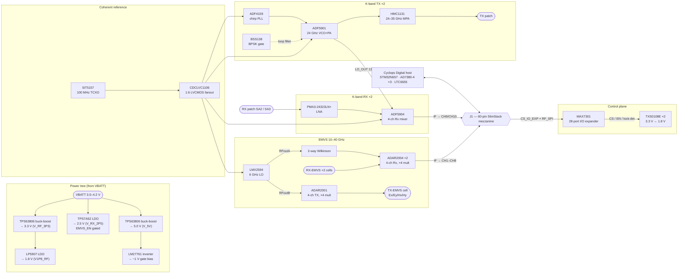

# Cyclops Analog Board

## Interconnect, Pin Assignment & Board-Level ICD

**K-band FMCW DDM-MIMO + Dual-Band Polarimetric EMVS — RF / Mixed-Signal Daughterboard**

24.125 GHz + 10–40 GHz | ADF5901 ×2 · ADF4159 ×2 · HMC1131 ×2 · PMA3 ×2 · ADF5904 · ADAR2001 · ADAR2004 ×2 · LMX2594 · MAX7301

**HW-AIB-001 — Rev E** | Companion to HW-RDR-001 Rev E (full-system block diagram & STM32N657 ICD)

Ocupoint | **CONFIDENTIAL**

---

### Revision History

| Rev | Date | Author | Description |
|-----|------|--------|-------------|
| E | 2026-05-20 | E. Pentland | Board-level interconnect reference for the Cyclops Analog daughterboard. Documents the complete intended design: power tree (3.3 V / 1.8 V / 2.5 V / 5 V / negative gate bias), MAX7301 control fanout, TXS0108E level-shift boundary, SiT5157 reference + 1:6 fanout, and the full RF/IF signal chains, with every net that crosses the mezzanine connector to the Cyclops Digital host. Aligned to HW-RDR-001 Rev E §13. |

### Document Information

| Field | Value |
|-------|-------|
| Document Number | HW-AIB-001 |
| Title | Cyclops Analog Board — Interconnect, Pin Assignment & Board-Level ICD |
| Revision | E (Draft) |
| Classification | CONFIDENTIAL — Ocupoint Internal |
| Board | Cyclops Analog (RF / mixed-signal daughterboard), Rev E |
| Designed by | Eugene Pentland |
| Host | Cyclops Digital (STM32N657, `src/stm32n6.sexp`) via 60-pin SlimStack mezzanine |
| Source of truth | `projects/designs/src/cyclops/cyclops-analog.sexp` + `cyclops-analog.bom` |
| Parent document | HW-RDR-001 Rev E (full-system ICD, M. Orr / Ocupoint) |

---

## 1. Purpose & Scope

This document describes **how every part on the Cyclops Analog daughterboard is wired together** — the board's power tree, control plane, clock distribution, and the RF/IF signal chains — and how those nets cross the mezzanine connector to the Cyclops Digital host.

The analog board carries the entire RF / mixed-signal front end **except** the STM32N657 MCU, the three AD7380-4 SAR ADCs, and the LTC6655 voltage reference, all of which live on the Cyclops Digital board (`src/stm32n6.sexp`). The two boards mate through a single 60-pin Molex SlimStack connector (J1). The digital-board side is documented in HW-RDR-001 §13; this is the analog-board complement.

---

## 2. Board Block Diagram

Board placement convention (HW-RDR-001 §1.1): TX1 | via wall | TX-EMVS cell at top-left, RX-EMVS Cell 1 top-right, RX-EMVS Cell 2 bottom-left, TX2 bottom-right.

---

## 3. Signal Chain Summary

### 3.1 K-band transmit (×2 paths)

| Stage | Part | Designator | Notes |
|-------|------|------------|-------|
| Chirp PLL | ADF4159 | `U_ADF4159_1/2` | 13 GHz fractional-N + ramp generator → ADF5901 VTUNE. `TXDATA_N` carries DDM π-phase / BPSK code. 3.3 V-native SPI. V_P charge pump from V_5V. |
| VCO + TX PA | ADF5901ACPZ | `U_ADF5901_1/2` | 24.0–24.25 GHz, internal ×2 doubler, +8 dBm. `LO_OUT` (13 GHz) of #1 feeds back to ADF4159 #1 **and** drives ADF5904 LO_IN. |
| BPSK gate | n2n7002 (BSS138-equiv) | `Q_BPSK_1/2` | NMOS shorts loop-filter cap `C_LF_5901_NA` when `BPSK_GATE_N` HIGH → widens PLL BW for comms. |
| MPA | HMC1131LC4 | `U_HMC1131_1/2` | +22 dB / P1dB +24 dBm, 24–35 GHz. Drains from TX_EN-gated 5 V; negative gate bias, VG-before-VD sequenced. |
| TX antenna | K-band patch | — (off-board) | +30 dBm/path; combined EIRP +36 dBm. |

### 3.2 Main K-band receive (×2 beams)

| Stage | Part | Designator | Notes |
|-------|------|------------|-------|
| RX antenna | 7-elem K-band patch ×2 | — (off-board) | SA2 = Beam 1, SA3 = Beam 2. |
| LNA | PMA3-24323LN+ | `U_LNA1/2` | 24–32 GHz, +16 dB, NF 3.1 dB. Bias-tee (39 nH) on each VDD. Sets main-RX noise figure. |
| RX mixer + IF | ADF5904 | `U_ADF5904` | Quad-channel 24 GHz receiver; Ch A/B used (Beam 1/2), Ch C/D 50 Ω terminated. |
| IF return | — | via J1 | IF Ch A/B → connector **CH9/CH10** → AD7380-4 #3 on digital board. |

### 3.3 EMVS polarimetric receive (×2 cells)

| Stage | Part | Designator | Notes |
|-------|------|------------|-------|
| EMVS cell | PCB copper [Ex Ey Hx Hy] | — (off-board) | 3.16 × 3.16 mm, 4-component probe. |
| 4-ch Rx mixer | ADAR2004ACCZ | `U1` (Cell 1), `U2` (Cell 2) | 10–40 GHz, ×4 on-die LO mult. RFIN1-4 → IFOUT1-4. |
| IF return | — | via J1 | **Cell 1 (`U1`) → CH5–CH8** (ADC2); **Cell 2 (`U2`) → CH1–CH4** (ADC1). |

### 3.4 EMVS transmit

| Stage | Part | Designator | Notes |
|-------|------|------------|-------|
| Wideband TX | ADAR2001ACCZ | `U_TX_EMVS` | 10–40 GHz, 4-ch TX, on-die ×4 multiplier. RFIN ← LMX2594 RFoutB. RFOUT1-4 → TX-EMVS cell Ex/Ey/Hx/Hy (100 Ω diff). Replaces both bow-tie antennas; per-chirp pol-cycling via `TxADV`. |

### 3.5 LO synthesis & reference

| Stage | Part | Designator | Notes |
|-------|------|------------|-------|
| EMVS LO | LMX2594RHAT | `U_LMX2594` | 6 GHz PLL+VCO. RFoutA → 2-way Wilkinson → ADAR2004 #1/#2 LOIN (+3.5 dBm/port); RFoutB → ADAR2001 RFIN (+7 dBm). ×4 in each ADAR → 24 GHz, phase-coherent (single VCO). |
| Reference | SiT5157 100 MHz TCXO | `Y1` | Coherent reference fanned out ×6 via CDCLVC1106 (see §9). Gated by `TCXO_EN` (MAX7301 P15). |

---

## 4. Power Domain Summary

The analog board generates **all** of its own rails from raw battery; only **VBATT** and **GND** cross the connector as power (the host's 1.8 V on pins 14/16 is left unused to avoid a ground loop between the two 1.8 V planes).

| Rail | Voltage | Source | Designator | Loads | Est. current | Enable |
|------|---------|--------|------------|-------|--------------|--------|
| VBATT | 3.0–4.2 V | J1 pins 4/6/8/10 (1S LiPo) | — | All on-board regulators | ≤500 mA cont. | (always) |
| **V_RF_3P3** | 3.3 V | TPS63806 buck-boost | `U_BUCK33` | ADF5901 ×2, ADF4159 ×2, ADF5904, MAX7301, LMX2594, PMA3 ×2, SiT5157, CDCLVC1106, TXS0108E VCCB, LP5907 input | ~0.8 A | (always) |
| **V1P8_RF** | 1.8 V | LP5907-1.8 LDO | `U_LDO18` | TXS0108E VCCA only | ~30 mA | (always) |
| **V_RX_2P5** | 2.5 V | TPS7A52 LDO | `U_LDO25` | ADAR2001 VPOS + ADAR2004 ×2 VPOS | ~910 mA | **EMVS_EN** |
| **V_5V** | 5.0 V | TPS63806 buck-boost | `U_BUCK5` | ADF4159 ×2 V_P (charge pump); HMC1131 ×2 drains (via TX_EN switch) | ~0.5 A | **PLL_EN** |
| **V_TX_5V** | 5.0 V | TX_EN load switch off V_5V | `U_SW_TX5` | HMC1131 ×2 drains | ~450 mA | **TX_EN** |
| **V_NEG_GATE** | −0.5…−1.5 V | LM27761 inverter off V_5V | `U_NEG` | HMC1131 ×2 gate bias | <20 mA | TX_EN (sequenced) |

**3.3 V buck-boost (`U_BUCK33`, TPS63806).** VBATT → 3.3 V. FB divider 560 k / 100 k → VOUT = 0.5 × (1 + 5.6) = 3.3 V (0.5 V ref). 1 µH XFL4012 between SW_L1/SW_L2. EN tied to VIN (always-on); MODE = GND (auto PFM/PWM, 13 µA Iq). A buck-*boost* is used (not an LDO) because VBATT sags to 3.0 V at end-of-discharge, below a 3.3 V LDO's dropout; the TPS63806 holds 3.3 V down to 1.8 V VIN.

**5 V buck-boost (`U_BUCK5`, TPS63806).** Same converter as the digital board's main rail (`blocks/buck-boost.sexp`) and the analog 3.3 V rail — one qualified part across the program. VBATT → 5.0 V; FB divider 909 k / 100 k → VOUT = 0.5 × (1 + 9.09) ≈ 5.05 V; 1 µH XFL4012; 2 A capable (TPS63806 VOUT range 1.8–5.5 V). EN = `PLL_EN`, so the 5 V rail is up whenever the PLLs are enabled. It feeds the ADF4159 charge-pump supply (V_P, ~10 mA each, needs ≥ AVDD + 0.3 V) directly, and the HMC1131 drains through a TX_EN-gated high-side load switch (`U_SW_TX5` → `V_TX_5V`).

**Negative gate bias (`U_NEG`, LM27761).** Regulated charge-pump inverter off V_5V generates the HMC1131 gate rail (≈ −1 V, per-device trim −0.5…−1.5 V). The HMC1131 requires **VG present before VD** on power-up and **VD removed before VG** on power-down; the TX_EN load switch on `V_TX_5V` is released only after `V_NEG_GATE` is established, enforcing the sequence.

**2.5 V LDO (`U_LDO25`, TPS7A52).** VBATT → 2.5 V, ultra-low-noise (4.4 µVRMS), 2 A — comfortably above the ~910 mA Rev E EMVS load (ADAR2001 ~180 mA + ADAR2004 ×2 ~370 mA each). FB divider sets 2.5 V; **EN = `EMVS_EN`** so the whole EMVS analog supply gates with the rail. (For the lowest-noise alternative, two paralleled LT3045-1 with ballast resistors are pin-for-pin viable, at higher cost and board area.)

**1.8 V LDO (`U_LDO18`, LP5907-1.8).** V_RF_3P3 → 1.8 V, low-noise; sole load is the TXS0108E VCCA pins. Each ADAR/LMX chip makes its own internal 1.8 V VREG, so only the level shifters need an external 1.8 V. Pin 4 is a no-connect — **left floating in layout** (not tied to GND).

---

## 5. Mezzanine Connector (J1) — Full Pin Allocation

**Connector:** Molex SlimStack **204927-0601** receptacle (analog board), mating 1:1 with the **204928-0601** plug on the Cyclops Digital board. 60-pin, 0.4 mm pitch. Even row = power / SPI / control GPIO; odd row = 10 differential IF pairs with GND shields between pairs. The pinout is identical across all cyclops-* analog boards so the digital host is unchanged.

> Note: HW-RDR-001 §13 lists the analog receptacle as 205266-0601; the design uses 204927-0601. Both are 60-pin 0.4 mm SlimStack receptacles — confirm the exact ordering P/N against the digital-board plug before fab.

### 5.1 Power & ground

| Pin(s) | Net | Direction | On-board destination |
|--------|-----|-----------|----------------------|
| 4, 6, 8, 10 | VBATT | in (3.0–4.2 V) | TPS63806 ×2 + TPS7A52 inputs |
| 14, 16 | V1P8 | in (1.8 V) | host 1.8 V — unused (board makes its own) |
| 2, 12, 28, 36, 48, 60 | GND | — | Ground plane (even row) |
| 1, 7, 13, 19, 25, 31, 37, 43, 49, 55 | GND | — | Diff-pair shields (odd row) |
| MP1–MP4 | GND | — | Mechanical pegs |

### 5.2 RF configuration bus + control GPIO (even row)

| Pin | Net | Dir | On-board destination |
|-----|-----|-----|----------------------|
| 26 | CS_IO_EXP | in | MAX7301 *CS (the **only** chip select crossing the connector) |
| 30 | RF_SPI_SCK | in | MAX7301 SCK + all RF-chip SCLK (shared) |
| 32 | RF_SPI_MOSI | in | MAX7301 DIN + all RF-chip SDI (shared) |
| 34 | RF_SPI_MISO | out | MAX7301 DOUT + RF-chip SDO (tri-state, shared) |
| 38 | TXDATA_1 | in | ADF4159 #1 TXDATA (3.3 V-native, no shift) |
| 40 | TXDATA_2 | in | ADF4159 #2 TXDATA |
| 42 | BPSK_GATE_1 | in | BSS138 #1 gate (ADF4159 #1 loop filter) |
| 44 | BPSK_GATE_2 | in | BSS138 #2 gate (ADF4159 #2 loop filter) |
| 46 | MRST | in | **3-way**: ADAR2001 + ADAR2004 ×2 (mult reset) → via TXS0108E |
| 50 | TxADV | in | ADAR2001 TxADV **only** (Rev E: was RxRST). Per-chirp pol-cycle, 3 ns min pulse → via TXS0108E |
| 54 | RxADV | in | ADAR2004 ×2 RxADV (tied) → via TXS0108E |
| 58 | MADV | in | **3-way**: ADAR2001 + ADAR2004 ×2 (mult advance) → via TXS0108E |
| 52 | CNV_MASTER | in | 2 MHz ADC convert sync ref (bring-up reference) |
| 56 | CHIRP_START | in | 28.6 kHz chirp-rate ref (LMX ramp / TxADV / scope sync) |
| 18 | EXP_SPI_SCK | in | SPI3 expansion (reserved) |
| 20 | EXP_SPI_MISO | out | SPI3 expansion (reserved) |
| 22 | EXP_SPI_MOSI | in | SPI3 expansion (reserved) |
| 24 | EXP_SPI_NCS | in | SPI3 expansion (reserved, 10 k PU) |

### 5.3 Differential IF returns (odd row → digital-board ADCs)

Outputs from the analog board: ±2.5 V differential, 1.25 V common-mode (VREF/2). Each ADC serves exactly one source (no mixed DMA buffers).

| Pins (+/−) | Net | Digital ADC | ADC ch | Analog-board IF source |
|-----------|-----|-------------|--------|------------------------|
| 3 / 5 | ADF_CH1 | ADC1 (AD7380-4 #1) | AINA | ADAR2004 #2 (`U2`) IF1 — RX-EMVS Cell 2 Ex |
| 9 / 11 | ADF_CH2 | ADC1 | AINB | ADAR2004 #2 IF2 — Cell 2 Ey |
| 15 / 17 | ADF_CH3 | ADC1 | AINC | ADAR2004 #2 IF3 — Cell 2 Hx |
| 21 / 23 | ADF_CH4 | ADC1 | AIND | ADAR2004 #2 IF4 — Cell 2 Hy |
| 27 / 29 | ADF_CH5 | ADC2 (AD7380-4 #2) | AINA | ADAR2004 #1 (`U1`) IF1 — RX-EMVS Cell 1 Ex |
| 33 / 35 | ADF_CH6 | ADC2 | AINB | ADAR2004 #1 IF2 — Cell 1 Ey |
| 39 / 41 | ADF_CH7 | ADC2 | AINC | ADAR2004 #1 IF3 — Cell 1 Hx |
| 45 / 47 | ADF_CH8 | ADC2 | AIND | ADAR2004 #1 IF4 — Cell 1 Hy |
| 51 / 53 | ADF_CH9 | ADC3 (AD7380-4 #3) | AINA | ADF5904 Ch A IF — Main RX Beam 1 |
| 57 / 59 | ADF_CH10 | ADC3 | AINB | ADF5904 Ch B IF — Main RX Beam 2 |

**Rev E remap:** ADC1 = EMVS Cell 2 (all 4 ch), ADC2 = EMVS Cell 1 (all 4 ch), ADC3 = main beam. Pure analog-board trace routing; digital board and connector unchanged.

**Idle-state biasing:** when `EMVS_EN` is de-asserted the ADAR2004 IF outputs go high-Z. Each IF leg carries a 100 kΩ keeper resistor to a local 1.25 V mid-bias node (a bypassed divider off V_RF_3P3) so the AD7380-4 inputs never float into latch-up; firmware additionally halts ADC sampling before dropping `EMVS_EN`.

---

## 6. Control Plane — MAX7301 I/O Expander (`U_IOEXP`)

A single STM32 chip-select (`CS_IO_EXP`, J1 pin 26) drives the MAX7301ATL+ 28-port SPI expander, which **fans out every RF chip select, master enable, ADAR control, and lock-detect input** on the board. Powered from V_RF_3P3; SPI Mode 0, ≤26 MHz. ISET = 39 kΩ to GND (pin 36).

| Port | IC pin | Net | Dir | Function | Boot termination |
|------|--------|-----|-----|----------|------------------|
| P4 | 30 | CS_ADF4159_1 | out | ADF4159 #1 *CS | 10 k PU → 3.3 V |
| P5 | 28 | CS_ADF4159_2 | out | ADF4159 #2 *CS | 10 k PU |
| P6 | 26 | CS_ADF5901_1 | out | ADF5901 #1 *CS | 10 k PU |
| P7 | 24 | CS_ADF5901_2 | out | ADF5901 #2 *CS | 10 k PU |
| P8 | 1 | CS_ADF5904_1 | out | ADF5904 *CS | 10 k PU |
| P9 | 3 | CS_RX1 | out | ADAR2004 #1 (`U1`) *CS | 10 k PU |
| P10 | 5 | CS_RX2 | out | ADAR2004 #2 (`U2`) *CS | 10 k PU |
| P11 | 7 | CS_LMX2594 | out | LMX2594 *CS | 10 k PU |
| P12 | 2 | TX_EN | out | K-band TX master enable (5 V drain switch + ADF5901 CE) | 10 k PD → GND |
| P13 | 4 | RX_EN | out | K-band RX master enable | 10 k PD |
| P14 | 6 | EMVS_EN | out | EMVS 2.5 V rail + level-shifter OE enable | 10 k PD |
| P15 | 8 | TCXO_EN | out | SiT5157 TCXO output enable | 10 k PD |
| P16 | 9 | PLL_EN | out | ADF4159 / ADF5904 CE + 5 V buck-boost EN | 10 k PD |
| P17 | 10 | LD_ADF4159_1 | **in** | ADF4159 #1 lock detect | 56 k PU |
| P18 | 12 | LD_ADF4159_2 | **in** | ADF4159 #2 lock detect | 56 k PU |
| P19 | 13 | LD_LMX2594 | **in** | LMX2594 lock detect | 56 k PU |
| P20 | 14 | CS_ADAR2001 | out | ADAR2001 *CS | 10 k PU |
| P21 | 15 | RxRST | out | ADAR2004 ×2 reset (relocated from J1 pin 50) | — |
| P22 | 16 | TxRST | out | ADAR2001 TX reset | — |
| P23 | 17 | ADAR2001_TXEN | out | ADAR2001 PA power gate (drives PFET load switch on its 2.5 V feed) | 10 k PD |
| P24 | 18 | ADAR2001_FAULT | **in** | ADAR2001 fault | 56 k PU |
| P25–P31 | 19,21,22,23,25,27,29 | IO_SPARE_25..31 | — | reserved spares | per-use |

**Pull strategy:** active-low *CS lines pull **up** (deasserted at boot); active-high EN lines pull **down** (rails off at boot); lock-detect inputs pull **up** (default "locked" so a not-yet-programmed PLL doesn't trip a fault). MAX7301 DOUT is never tri-state — firmware must never assert two CS lines simultaneously on the shared MISO bus.

---

## 7. Level-Shift Boundary — TXS0108E ×2

Only **ADAR2001, ADAR2004 ×2, and LMX2594** use 1.8 V digital I/O. Everything else — ADF4159, ADF5901, ADF5904, BSS138, and the MAX7301 itself — is 3.3 V-native and needs **no** translation. Two TXS0108E (8-bit auto-direction-sensing) shifters bridge the 16 nets that cross 3.3 V ↔ 1.8 V:

- **VCCA** = V1P8_RF (1.8 V), **VCCB** = V_RF_3P3 (3.3 V), **OE** = `EMVS_EN`. Tying OE to `EMVS_EN` holds both sides Hi-Z whenever the EMVS rail is off, so the 3.3 V host side cannot inject current into a quiescent 1.8 V bus. The B-side (3.3 V) net keeps the base name; the A-side (1.8 V) net carries the `_1V8` suffix.

| Shifter | B-side (3.3 V, host) | A-side (1.8 V, RF IC) |
|---------|----------------------|------------------------|
| `U_LS1` | RF_SPI_SCK / MOSI / MISO, CS_RX1, CS_RX2, CS_LMX2594, CS_ADAR2001, LD_LMX2594 | corresponding `*_1V8` nets |
| `U_LS2` | TxADV, MRST, MADV, RxADV, RxRST, TxRST, ADAR2001_TXEN, (1 spare) | corresponding `*_1V8` nets |

Place each shifter within 5 mm of its most timing-critical destination (ADAR2001 `TxADV`, 3 ns minimum pulse). The auto-direction TXS0108E edge rate is ~5 ns; if pulse-width margin on `TxADV`/`MADV`/`MRST` becomes tight, substitute a 2-bit TXS0102 on those lines.

---

## 8. Per-Component Connection Tables

Designators are the schematic instance labels; auto-assigned BOM ref-des are in `cyclops-analog.bom`.

### 8.1 ADF4159 ×2 — chirp PLL (`U_ADF4159_1/2`, LFCSP-24)

| Pin | Net | Connection |
|-----|-----|------------|
| CPOUT (4) | CPOUT_N | → 2nd-order active loop filter → ADF5901 #N VTUNE |
| RFIN A (8) | ADF5901_N_LO_OUT (10 pF AC) | ← ADF5901 #N LO_OUT (13 GHz feedback); RFIN B (9) 50 Ω term |
| REFIN (11) | RADAR_REF_AC | ← 100 MHz reference (AC-coupled) |
| TXDATA (13) | TXDATA_N | ← J1 pin 38/40 (DDM π-phase / BPSK) |
| DATA/CLK/LE (14/15/16) | RF_SPI_MOSI / SCK / CS_ADF4159_N | 3.3 V-native SPI |
| CE (17) | PLL_EN | ← MAX7301 P16 (10 k PU) |
| MUXOUT (18) | LD_ADF4159_N | → MAX7301 P17/P18 (lock detect) |
| AVDD / AVDD_VCO (2,21,22) | V_RF_3P3 | 3.3 V analog |
| DVDD (5,12) | V1P8_RF | 1.8 V digital |
| V_P (20) | V_5V | charge-pump supply (≥ AVDD + 0.3 V) |
| RSET (1) | 10 kΩ to AGND | ICP = 25.5 / RSET = 2.55 mA |

### 8.2 ADF5901 ×2 — 24 GHz TX VCO+PA (`U_ADF5901_1/2`, ADF5901ACPZ, LFCSP-32)

| Pin group | Net | Connection |
|-----------|-----|------------|
| TX_OUT1 (2) | TX1_RFOUT / TX2_RFOUT | → HMC1131 #N RFIN |
| LO_OUT (11) | ADF5901_N_LO_OUT | #1 → ADF4159 #1 RFIN A feedback **and** ADF5904 LO_IN; #2 → 50 Ω term |
| VTUNE (29) | VTUNE_N | ← ADF4159 #N loop-filter output |
| REFIN (15) | RADAR_REF_AC | ← 100 MHz reference (AC-coupled) |
| CE (20) | TX_EN | ← MAX7301 P12 (whole TX chain off when LOW) |
| CLK/DATA/LE/DOUT (21/22/23/24) | RF_SPI_SCK / MOSI / CS_ADF5901_N / MISO | 3.3 V-native SPI |
| AVDD group | V_RF_3P3 | 3.3 V analog rails, multi-cap bypass |
| DVDD (32) | V1P8_RF | 1.8 V digital |
| VREG (18) | VREG_5901_N | on-chip 1.8 V LDO bypass |

Loop filter (per path): 2nd-order active, R 510 Ω + 0 Ω + 0 Ω, C 3.3 nF / 220 pF / 100 pF (`R/C_LF_5901_N*`) from CPOUT to VTUNE; final values from ADIsimPLL for the 24 GHz / 35 µs ramp / 2.55 mA ICP design point (§13).

### 8.3 BSS138 BPSK gate ×2 (`Q_BPSK_1/2`, n2n7002, SOT-23)

Gate ← `BPSK_GATE_N` (J1 pin 42/44, 3.3 V direct); Source → GND; Drain → `LF1_5901_N` (across loop-filter cap `C_LF_5901_NA`). 100 kΩ gate pull-down keeps the FET off (radar mode = fail-safe) during STM32 boot. HIGH widens loop BW for BPSK comms.

### 8.4 HMC1131 ×2 — 24–35 GHz MPA (`U_HMC1131_1/2`, LCC-24)

| Pin | Net | Connection |
|-----|-----|------------|
| RFIN (1) | TXn_RFOUT_5901 | ← ADF5901 #N TX_OUT1 (+8 dBm) |
| RFOUT (24) | TXn_RFOUT | → TXn K-band patch (+30 dBm) |
| VD1/VD2/VD3 (3,8,13) | V_TX_5V (via bias R) | TX_EN-gated 5 V drains (~225 mA total/chip) |
| VG1/VG2/VG3 (4,9,14) | V_NEG_GATE (per-gate bias net) | −0.5…−1.5 V, VG-before-VD sequenced |
| EPAD | GND | thermal via array (1.125 W, θJA ≤ 44 °C/W) |

### 8.5 PMA3-24323LN+ ×2 — K-band LNA (`U_LNA1/2`, LFCSP)

RF-IN (2) ← `BEAMn_RFIN` (RX patch SA2/SA3, 50 Ω); RF-OUT (8) → `BEAMn_LNAOUT` → ADF5904 RFIN_A/B+. Four VDD pins tied to `VDD_LNAn`, fed from V_RF_3P3 through a 39 nH bias-tee inductor with 100 nF / 1 nF / 10 pF / 10 µF decoupling.

### 8.6 ADF5904 — 4-channel K-band Rx (`U_ADF5904`, LFCSP-32)

| Pin group | Net | Connection |
|-----------|-----|------------|
| RFIN_A+ (1) | BEAM1_LNAOUT | ← PMA3 #1 (Beam 1, single-ended drive); RFIN_A− 50 Ω term |
| RFIN_B+ (3) | BEAM2_LNAOUT | ← PMA3 #2 (Beam 2); RFIN_B− 50 Ω term |
| RFIN_C/D ± | 50 Ω term | Ch C/D unused |
| LO_IN (9) | ADF5901_1_LO_OUT | ← ADF5901 #1 LO_OUT (−1 dBm, AC-coupled) |
| IF_A ± (11/12) | ADF_CH9 P/N | → J1 CH9 → AD7380-4 #3 AINA (Beam 1) |
| IF_B ± (13/14) | ADF_CH10 P/N | → J1 CH10 → AD7380-4 #3 AINB (Beam 2) |
| DATA/CLK/LE/MUXOUT (23/24/25/27) | RF_SPI_MOSI / SCK / CS_ADF5904_1 / MISO | 3.3 V-native SPI |
| CE (26) | RX_EN | ← MAX7301 P13 |
| REFIN (28) | RADAR_REF_AC | ← 100 MHz reference (AC-coupled) |
| DVDD/AVDD | V1P8_RF / V_RF_3P3 | per datasheet |

IF common-mode (~1.65 V) is matched to the AD7380-4 input range via AC-coupling at the connector; verify against VREF/2 (1.25 V) on the digital board.

### 8.7 ADAR2001 — EMVS wideband TX (`U_TX_EMVS`, ADAR2001ACCZ, 40-LGA)

| Pin group | Net | Connection |
|-----------|-----|------------|
| RFIN (4) | LMX_RFOUTB_SE | ← LMX2594 RFoutB direct (single-ended 50 Ω, +7 dBm) |
| RFOUT1+/− (34/33) | TX_EMVS_Ex± | → TX-EMVS Ex dipole (100 Ω diff) |
| RFOUT2+/− (29/28) | TX_EMVS_Ey± | → Ey dipole |
| RFOUT3+/− (23/24) | TX_EMVS_Hx± | → Hx loop |
| RFOUT4+/− (18/19) | TX_EMVS_Hy± | → Hy loop |
| VPOS1/3/4/5 (1,21,31,40) | V_RX_2P5 | 2.5 V analog (PA power-gated via MAX7301 P23 PFET) |
| VREG/VPOS2 (6,7) | TX_EMVS_VREG | on-chip 1.8 V LDO → VPOS2 tied directly to VREG (1 µF close) |
| SPI (12/13/14/15) | RF_SPI_SCK/MOSI_1V8, CS_ADAR2001_1V8, RF_SPI_MISO_1V8 | 1.8 V via TXS0108E |
| State machine (8/9/10/11) | TxADV / TxRST / MADV / MRST `_1V8` | 1.8 V via TXS0108E |

*CS pulled up 200 kΩ to on-chip VREG (1.8 V). The PA has no dedicated TXEN pin — `ADAR2001_TXEN` (MAX7301 P23) drives a PFET load switch on the IC's 2.5 V feed, so the PA is powered only during EMVS TX dwells.

### 8.8 ADAR2004 ×2 — EMVS 4-ch Rx mixer (`U1` Cell 1, `U2` Cell 2, ADAR2004ACCZ, 48-LGA)

| Pin group | Net | Connection |
|-----------|-----|------------|
| RFIN1-4 ± | RXn_RFIN1..4± | ← RX-EMVS cell probes (Ex/Ey/Hx/Hy), 100 Ω diff |
| IFOUT1-4 ± | ADF_CHx P/N | `U1` → CH5–CH8; `U2` → CH1–CH4 (see §5.3) |
| LO_IN (35) | LO_RXn | ← LMX2594 RFoutA via Wilkinson (+3.5 dBm) |
| VPOS1/2/4 (1,13,38) | V_RX_2P5 | 2.5 V analog |
| VPOS3 + VREG (32,33) | Un_VREG | VPOS3 tied directly to on-chip VREG (1 µF) |
| SPI (24-27) | RF_SPI_MISO / CS_RXn / MOSI / SCK `_1V8` | 1.8 V via TXS0108E |
| State machine (28-31) | RxRST / RxADV / MRST / MADV `_1V8` | shared step/reset bus, 1.8 V |

*CS pulled up 200 kΩ to VREG.

### 8.9 LMX2594 — EMVS LO synthesizer (`U_LMX2594`, LMX2594RHAT, VQFN-40)

| Pin | Net | Connection |
|-----|-----|------------|
| OSCINP (8) | RADAR_REF_AC | ← 100 MHz reference (AC-coupled); OSCINM (9) → 100 pF to GND |
| RFOUTAP (23) | LMX_RFOUTA_SE | → 2-way Wilkinson → LO_RX1 + LO_RX2 (ADAR2004 ×2); RFOUTAM (22) 50 Ω term |
| RFOUTBP (19) | LMX_RFOUTB_SE | → ADAR2001 RFIN direct; RFOUTBM (18) 50 Ω term |
| CPOUT/VTUNE (12/35) | LMX_CPOUT / LMX_VTUNE | 3rd-order passive loop filter (200 Ω/100 Ω, 1 nF/10 nF/100 pF) |
| MUXOUT (20) | LD_LMX2594_1V8 | → MAX7301 P19 (lock detect) via TXS0108E |
| CE (1) | LMX_CE | 10 kΩ PU → 3.3 V (always-on) |
| SCK/SDI/CSB (16/17/24) | RF_SPI_SCK/MOSI_1V8, CS_LMX2594_1V8 | 1.8 V via TXS0108E |
| VCC* pins | V_RF_3P3 | 3.3 V (internal LDOs), per-pin 100 nF + 10 µF bulk |

**Wilkinson splitter** is PCB trace geometry (two λ/4 70.7 Ω arms at 6 GHz, ~6.6 mm on RO4350B, phase-matched ≤5°); only the 100 Ω isolation resistor (`R_WILK_ISO`) is a discrete component. 100 pF AC-coupling at each splitter output.

---

## 9. Clock & Reference Distribution

A single 100 MHz reference is fanned out to all six PLL/VCO chips so the whole RF front end is phase-coherent (essential for FMCW dechirp and DDM-MIMO separation).

**Reference oscillator — `Y1`, SiTime SiT5157AI-FA-33N0-100.000000.** MEMS Super-TCXO, 100.000000 MHz, ±1.0 ppm over −40…+85 °C, 3.3 V, LVCMOS output, 5.0 × 3.2 mm 4-pad ceramic. Its programmable feature pin is configured as **Output Enable**, driven by `TCXO_EN` (MAX7301 P15). Powered from V_RF_3P3 with 100 nF + 1 µF decoupling.

**Fanout buffer — `U_FANOUT`, TI CDCLVC1106 (1:6 LVCMOS, DC–250 MHz).** Input ← SiT5157 LVCMOS output. The six outputs each drive one chip's REFIN/OSCIN through a ~33 Ω series source termination and a DC-blocking cap (100 pF, since the RF chips' reference inputs are AC-coupled). Outputs are length-matched for low inter-chip skew. Powered from V_RF_3P3.

| Output | Destination | Net |
|--------|-------------|-----|
| Y0 | ADF4159 #1 REFIN | RADAR_REF_AC |
| Y1 | ADF4159 #2 REFIN | RADAR_REF_AC |
| Y2 | ADF5901 #1 REFIN | RADAR_REF_AC |
| Y3 | ADF5901 #2 REFIN | RADAR_REF_AC |
| Y4 | ADF5904 REFIN | RADAR_REF_AC |
| Y5 | LMX2594 OSCINP | RADAR_REF_AC |

| Derived LO | Source | Destination | Notes |
|------------|--------|-------------|-------|
| 24 GHz LO (main) | ADF5901 #1 LO_OUT (13 GHz) | ADF5904 LO_IN | −1 dBm; on-die fanout to Ch A/B |
| 6 GHz LO (EMVS) | LMX2594 RFoutA / RFoutB | RFoutA → ADAR2004 ×2 (Wilkinson); RFoutB → ADAR2001 | ×4 on-die in each ADAR → 24 GHz |

---

## 10. Net Naming Convention

| Pattern | Meaning | Example |
|---------|---------|---------|
| `CS_<CHIP>[_N]` | Per-chip select (from MAX7301) | `CS_ADF4159_1`, `CS_LMX2594` |
| `<FUNC>_EN` | Active-high master enable | `TX_EN`, `EMVS_EN`, `TCXO_EN` |
| `LD_<CHIP>` | Lock-detect input | `LD_LMX2594` |
| `<CHIP>_<PIN>` | Chip-to-chip direct | `ADF5901_1_LO_OUT`, `LMX_RFOUTB_SE` |
| `V_<DOMAIN>_<V>` | Power rail | `V_RF_3P3`, `V_RX_2P5`, `V1P8_RF`, `V_5V` |
| `<NET>_1V8` | 1.8 V-side of a level-shifted net | `RF_SPI_SCK_1V8`, `MRST_1V8` |
| `ADF_CH<n>P/N` | IF differential pair to ADC | `ADF_CH5P`, `ADF_CH10N` |
| `TX_EMVS_<comp>±` / `RXn_RFIN<k>±` | EMVS RF differential pairs | `TX_EMVS_Ex+`, `RX1_RFIN2-` |

---

## 11. RF Matching & Impedance Routing

All RF matching networks sit on the analog board at the IC pads (at 10–40 GHz a λ/4 is 0.75–3 mm — matching must be within that of the device). The antenna board is a passive 100 Ω-diff structure with no discretes.

- **ADAR2001 TX outputs / ADAR2004 RX inputs** — pi-match footprint per diff pair (one 0201 series + two 0201 shunt) within 0.5 mm of the pad, populated 0 Ω-series/open-shunt by default and tuned on a VNA. 100 Ω differential on RO4350B 0.508 mm; all pairs length-matched ≤0.1 mm. ADAR2001 → TX-EMVS ≤10 mm, 3 mm keep-out from K-band TX traces.
- **LMX2594 LO** — RFoutA 2-way Wilkinson (70.7 Ω λ/4 arms, 100 Ω iso resistor, phase-matched ≤5° at 6 GHz) within 15 mm of the LMX; RFoutB point-to-point 50 Ω microstrip ≤20 mm, 100 pF AC-coupling both ends.
- **HMC1131** — 1.125 W on LCC-24; ≥16 thermal vias under EPAD, θJA ≤ 44 °C/W.

---

## 12. Power-Up Sequence (firmware contract)

1. `TCXO_EN` HIGH → 10 ms settle (SiT5157 reference).
2. `PLL_EN` HIGH → enables ADF4159 / ADF5904 CE **and** the 5 V buck-boost.
3. Program ADF4159 ×2, ADF5901 ×2, ADF5904 over RF_SPI (CS via MAX7301).
4. `TX_EN` HIGH → negative gate bias established first, then the 5 V drain switch closes (VG-before-VD); wait 1 ms bias settle. Then `RX_EN` HIGH.
5. Program LMX2594; verify lock on `LD_LMX2594` (MAX7301 P19).
6. Program ADAR2001 + ADAR2004 ×2 (CS via MAX7301 P20/P9/P10).
7. `EMVS_EN` HIGH → enables the 2.5 V LDO **and** the TXS0108E OE; wait 1 ms.
8. Verify all locks (`LD_ADF4159_1/2`, `LD_LMX2594`); enable ADAR2001 PA via `ADAR2001_TXEN`; begin chirping (CNV_MASTER + CHIRP_START active).

`EMVS_EN` must go HIGH only after the 2.5 V rail is stable and before any SPI traffic to the ADAR/LMX chips (the level shifters are dark until then).

---

## 13. Calibration & Bring-Up Tuning

A handful of values are finalized on the bench rather than fixed in schematic, by design:

- **PLL loop filters** — ADF5901 ×2 (2nd-order active) from ADIsimPLL for the 24 GHz / 35 µs ramp / 2.55 mA ICP point; LMX2594 (3rd-order passive) from TI TICS Pro for the 6 GHz / 100 MHz-ref phase-noise & lock-time targets. Footprints are laid out; values dropped in after simulation.
- **RF pi-match networks** — populated 0 Ω-series/open-shunt as default; tuned per port on a VNA (S11 across 10–40 GHz) during bring-up.
- **HMC1131 gate bias** — `V_NEG_GATE` trimmed per device (−0.5…−1.5 V) for target drain current; verified before the drain switch is enabled.
- **Reference fanout skew** — CDCLVC1106 output traces length-matched; residual skew characterized at bring-up.

---

*Generated from `projects/designs/src/cyclops/cyclops-analog.sexp` (Rev E), cross-referenced against HW-RDR-001 Rev E §13. Reference oscillator: [SiT5157AI-FA-33N0-100.000000](https://www.sitime.com/parts/sit5157ai-fa-33n0-100000000). View the live schematic at `/schematics/cyclops-analog` on the EDA server.*
